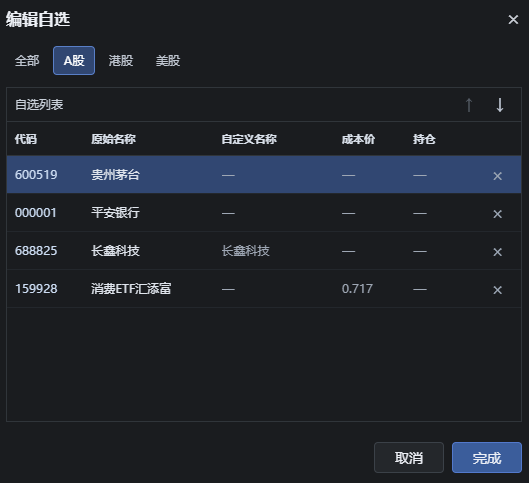
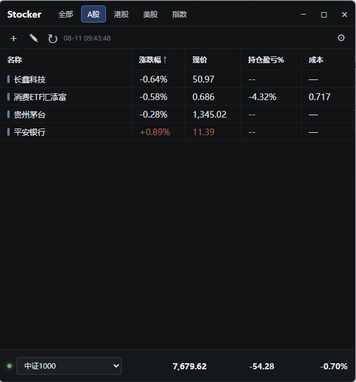
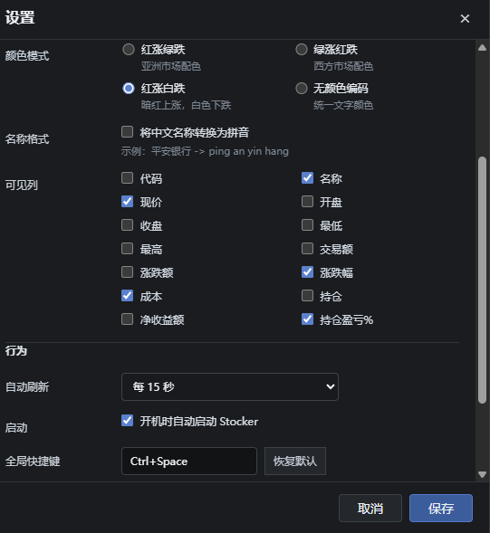

# Stocker

## Screenshots







一个面向 Windows 与 macOS 的轻量桌面自选股工具，使用 Tauri 2 构建。

## 特性

- 通过腾讯财经的公开批量报价接口，一次请求获取所有自选股，降低刷新延迟。
- 默认支持 A 股、港股与美股；可添加、编辑、删除和按市场筛选。
- 顶部“全部 / A股 / 港股 / 美股 / 指数”Tab 支持拖动排序，顺序会保存到本地；`Ctrl + 左/右方向键` 按当前顺序切换 Tab。
- 全部、A股、港股、美股和指数页都支持表头升序/降序排序；各页排序方式独立保存，下次启动自动恢复。
- 10/15/30/60 秒自动刷新或手动刷新；自选项、配置和上次行情保存在本机。
- 支持盯盘提醒：可分别为个股、ETF/LOF/基金和全部市场指数设置涨跌幅百分比阈值，也可为单个自选标的设置覆盖阈值。
- 填写 `3` 表示涨跌幅达到 `3%` 时通过 Windows/macOS 系统通知提醒；回到阈值内后再次越过才会重复提示，避免连续弹窗。
- 有盯盘告警时，托盘图标会在默认图标与暗红色提醒图标之间闪动；全部标的回到阈值内后自动恢复。
- Rust 后端访问行情接口，规避浏览器跨域限制；使用系统 WebView，不捆绑 Chromium，不收集用户数据，也不需要 API Key。

## 启动

需要 Rust（stable）和 Node.js 20 或更高版本：

```powershell
npm install
npm start
```

## 打包

在对应操作系统上执行：

```powershell
npm run dist
```

Windows 会生成 NSIS 安装包，macOS 会生成 DMG 和 APP。Tauri 使用系统 WebView，因此产物通常远小于 Electron；跨平台安装包仍建议在各自操作系统或 CI 上分别构建。

## 代码格式

- A 股：`600519`、`000001`，也支持 `sh600519`、`sz000001`
- 港股：`00700`、`09988`
- 美股：`AAPL`、`NVDA`、`TSLA`

行情是公开信息服务，存在延迟或临时不可用的可能，不应作为交易依据。
